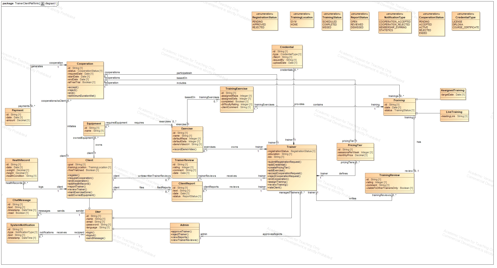
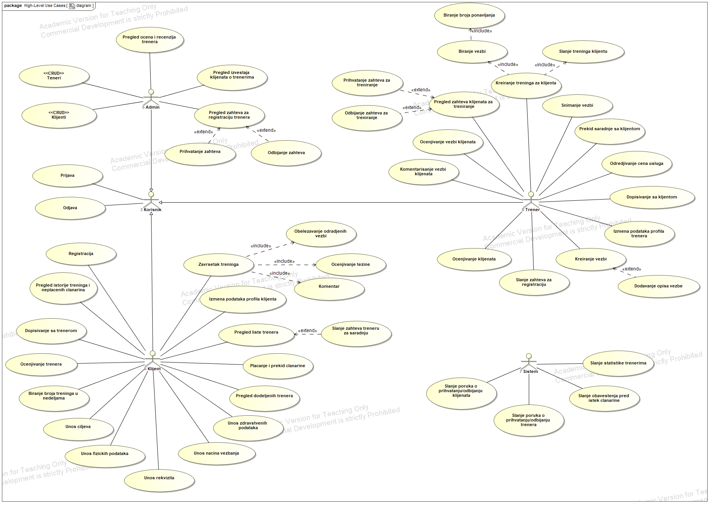

# FitConnect

ASP.NET Core Web API + React platform for connecting personal trainers and clients.

## 📒 Description

FitConnect lets a trainer create and assign trainings to clients, track their progress, and manage pricing plans and cooperations, while a client picks a trainer, follows assigned trainings — live or self-guided — logs their own health data, and rates trainers. An admin reviews trainer registration requests and credentials before approving them. Access to functionality and data is governed by three roles: **Admin**, **Trainer**, and **Client**.

## 📐 Diagrams

The diagrams capture the domain model and the system's functional scope. Activity, sequence, and state machine diagrams for the key flows are stored in diagrams folder alongside these.

### Class Diagram



### Use Case Diagram



## 🏗️ Architecture

The backend is split into four projects so business logic never depends on ASP.NET Core or the database driver, with dependencies flowing one way — outer layers depend on inner ones, never the reverse:

```
backend/
├── Database/
│   └── Scripts/
│       ├── database.sql      -- full schema, source of truth (no ORM/migrations)
│       └── seed.sql          -- local dev seed data
├── src/
│   ├── FitConnect.Domain/          -- entities, value objects, business rules
│   │                                  (zero framework dependencies)
│   ├── FitConnect.Application/     -- use-case services, repository interfaces
│   ├── FitConnect.Infrastructure/  -- Npgsql repositories, JWT, password hashing,
│   │                                  local file storage
│   └── FitConnect.Api/             -- controllers, request/response DTOs,
│                                       authorization policies, DI wiring
```

`Api → Infrastructure → Application → Domain`. Controllers stay thin — parse the request, call one Application service, map the result to an HTTP response; business rules live in `Domain`/`Application`, never in `Api`. Since there's no ORM, `Infrastructure` repositories map database rows to `Domain` entities by hand and issue explicit parameterized SQL against the schema in `database.sql`.

## 🔐 Authentication & Authorization

- **JWT bearer tokens** — obtained via `POST /api/auth/login` or one of the `POST /api/auth/register/*` endpoints, sent as `Authorization: Bearer <token>` on every subsequent request.
- **Role-based access control** — `Admin` / `Trainer` / `Client` — enforced declaratively with `[Authorize(Roles = "...")]` on controllers and actions.
- **Ownership and relationship checks** — "is this my own record", "am I this client's currently active trainer", "am I a participant in this cooperation" — are implemented as explicit ASP.NET Core authorization policies and handlers, kept in one place per rule rather than duplicated as `if` checks across controllers.
- **Sensitive data gets a stricter rule than ownership alone**: health records are readable only by the owning client or their currently accepted/active trainer — not by any other trainer, and not by an admin.

## ⚡ Features

- Trainer registration with credential upload (license/diploma/certificate) and admin approval workflow
- Client registration, profile management, and health-data history tracking
- Cooperation lifecycle: request → accept/reject → active → end, with pricing tiers and a one-time free trial
- Private per-trainer exercise library with equipment requirements and demo videos
- Training assignment (live or self-guided), exercise completion tracking, and per-training reviews
- Public trainer ratings and reviews, sortable trainer discovery
- Membership payment history
- Shared equipment catalog (apparatus and accessories)

## 🔧 Technologies

- **Backend**: C# / .NET 10 / ASP.NET Core Web API
- **Database**: PostgreSQL, accessed directly via Npgsql
- **Frontend**: React (separate project, consumes the API)
- **Auth**: JWT bearer tokens, role- and policy-based authorization

## 🔌 How to Run the Project

1. Clone the repository:
   ```bash
   git clone [https://github.com/<org>/FitConnect.git](https://github.com/nickola23/fit-connect.git)
   ```

2. Import the database:
   - The SQL script for creating the database is located in `Database/Scripts/` (`database.sql`), with optional local seed data in `seed.sql`.
   - Create a database named `fitconnect`.
   - Import the script into your database.

3. Configure the connection:
   - Set `ConnectionStrings:DefaultConnection` in `src/FitConnect.Api/appsettings.json` to point to your local database.
   - Set a `Jwt:SigningKey` value (any local dev secret works).

4. Start the API:
   ```bash
   dotnet run --project src/FitConnect.Api
   ```

5. Access the application:
   - The API listens on the port defined in `src/FitConnect.Api/Properties/launchSettings.json`.
   - Swagger/OpenAPI is available in development for browsing the live API contract.
